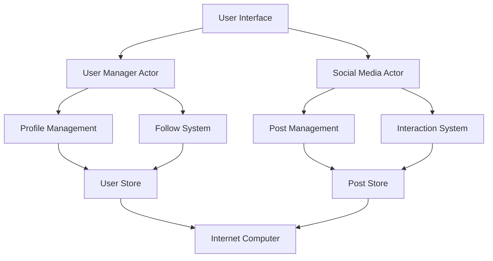
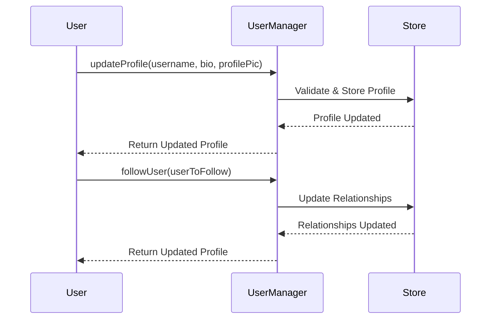
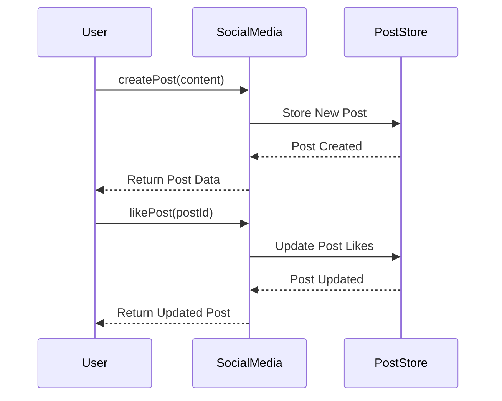

# Decentralized Social Media Platform
## Technical Documentation & Architecture Overview

## Table of Contents
1. [System Architecture](#system-architecture)
2. [Core Components](#core-components)
3. [User Flow Paths](#user-flow-paths)
4. [Data Models](#data-models)
5. [Security & Access Control](#security--access-control)
6. [Implementation Details](#implementation-details)
7. [Testing & Deployment](#testing--deployment)

## System Architecture

### High-Level Overview


The system is built on the Internet Computer platform using the Motoko programming language, implementing a fully decentralized social media platform with two main actors:
- UserManager: Handles user profiles and relationships
- SocialMediaDapp: Manages posts and interactions

## Core Components

### 1. User Management System


#### Key Features:
- Profile creation and management
- Follow/unfollow functionality
- Profile retrieval and updates
- Relationship management

### 2. Social Media Core


#### Key Features:
- Post creation and management
- Likes and comments system
- Feed generation
- Content validation

## User Flow Paths

### A. Profile Management Path
1. User Profile Creation
   ```motoko
   type UserProfile = {
       id: UserId;
       username: Text;
       bio: ?Text;
       profilePic: ?Text;
       followers: [UserId];
       following: [UserId];
       joinDate: Int;
   };
   ```
2. Profile Updates
3. Relationship Management
4. Profile Retrieval

### B. Content Management Path
1. Post Creation
   ```motoko
   type Post = {
       id: PostId;
       content: Text;
       author: Principal;
       timestamp: Int;
       likes: Nat;
       comments: [Comment];
   };
   ```
2. Post Interactions
3. Content Retrieval
4. Feed Generation

## Data Models

### User Data Structures
1. User Profile
2. Relationships
3. Activity History
4. Authentication Data

### Content Data Structures
1. Posts
2. Comments
3. Interactions
4. Content Metadata

## Security & Access Control

### A. Authentication
1. Principal-based authentication
2. Session management
3. Access control checks

### B. Authorization
1. Permission validation
2. Operation restrictions
3. Rate limiting

## Implementation Details

### A. User Manager Implementation
```motoko
public shared(msg) func updateProfile(username: Text, bio: ?Text, profilePic: ?Text) : async Result<UserProfile, Error> {
    let userId = msg.caller;
    // Profile update logic
};

public shared(msg) func followUser(userToFollow: UserId) : async Result<UserProfile, Error> {
    let followerId = msg.caller;
    // Follow logic
};
```

### B. Social Media Implementation
```motoko
public shared({ caller }) func createPost(content : Text) : async Result<Post, Error> {
    // Post creation logic
};

public shared({ caller }) func addComment(postId : PostId, content : Text) : async Result<Post, Error> {
    // Comment logic
};
```

## Testing & Deployment

### A. Test Suite Structure
1. Unit Tests
   ```motoko
   public shared func testCreatePost() : async Bool {
       // Test implementation
   };
   ```
2. Integration Tests
3. System Tests

### B. Deployment Process
1. Canister Setup
   ```bash
   dfx deploy social_media_dapp
   ```
2. Environment Configuration
3. System Initialization

### C. Monitoring & Maintenance
1. System Health Checks
2. Performance Monitoring
3. Error Handling

## Best Practices & Guidelines

### 1. Code Organization
- Maintain clear module separation
- Use consistent naming conventions
- Implement proper error handling

### 2. Performance Optimization
- Efficient data structures
- Optimized queries
- Proper memory management

### 3. Security Considerations
- Input validation
- Access control
- Rate limiting
- Data integrity checks

## Future Enhancements

### Phase 1: Core Features
- [ ] Enhanced content moderation
- [ ] Rich media support
- [ ] Advanced search capabilities

### Phase 2: Advanced Features
- [ ] Content recommendation system
- [ ] Analytics dashboard
- [ ] API integrations

### Phase 3: Platform Scaling
- [ ] Performance optimizations
- [ ] Enhanced security features
- [ ] Cross-platform support